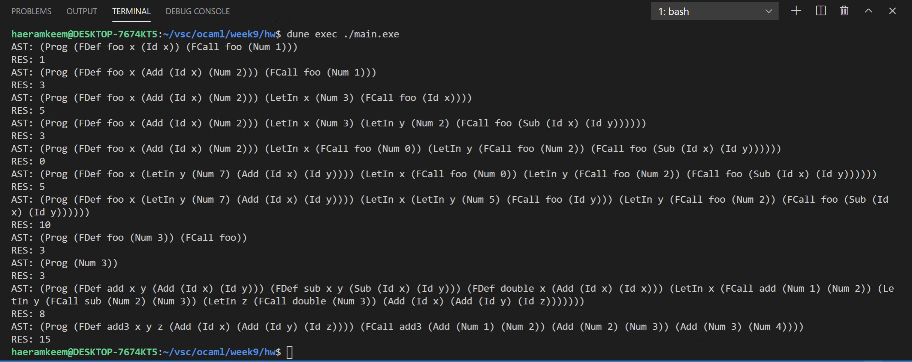

# 201702004 김해람 프로그래밍 언어 개론 9주차 과제
#21년1학기/프로그래밍언어개론/보고서

## 과제 설명
* 인자를 0개 이상 받는 first-order 함수를 0개 이상 지원하는 VAE인 F1VAE를 구성해본다.

## 해결방법
### interp_e 함수
* 인자로 받은 e에 대해 :
* **Add** : 튜플로 주어진 두 expression을 interp_e함수를 재귀호출해 계산하여 덧셈 후 반환한다.
* **Sub** :  튜플로 주어진 두 expression을 interp_e함수를 재귀호출해 계산하여 뺄셈 후 반환한다.
* **LetIn** : 주어진 튜플의 두번째 원소 expression을 interp_e를 재귀호출해 계산 후 그 값을 Store.insert함수를 이용해 기존의 s에 추가한다. 그리고 이 것을 새로운 s로 interp_e함수를 재귀호출하여 튜플의 세번째 원소 expression을 계산한다.
* **FCall** : 일단 매개변수를 인자로 치환하는 방법이 아닌 매개변수와 그것에 대응하는 인자를 Store을 이용해 추상메모리에 저장하고 함수의 몸체를 계산할 때 쓸 것이기 때문에 인자 리스트와 매개변수 리스트를 받아 추상메모리를 반환하는 함수 make_fstore을 내부적으로 선언한다. 그리고 이것을 이용해 매개변수들이 등록된 메모리를 얻어내고, 이 메모리를 이용해 함수의 몸체를 계산하는 방식으로 구현하였다.
	* 먼저 인자 리스트인 _plist_ 에 대해 match를 시도한다. _plist_ 가 비었을 경우에는 매개변수 리스트 _fargs_ 도 비었는지 검사해 비었을 경우에는 입력받은 인자의 갯수와 매개변수의 갯수가 동일한 경우이므로 누산기 _acc_ 를 반환한다. 하지만 비지 않았을 경우에는 두 리스트의 갯수가 다르다는 의미이므로 failwith로 오류를 일으키게 한다. _plist_ 가 비지 않았을 경우에는 expression형태로 주어진 인자를 리스트에서 하나 꺼낸다(꺼낸값 - _exp_ , 나머지 리스트 - _rest_param_ )
	* 그리고 _fargs_ 에 대해서도 match를 시도한다. 이 리스트가 비었다는 것 또한 갯수가 맞지 않다는 의미이기 때문에 failwith로 오류를 출력한다. 그리고 _fargs_ 에서 매개변수를 하나 꺼낸다(꺼낸 값 - _arg_, 나머지 리스트 - _rest_args_)
	* 그 이후 먼저 interp_e를 재귀호출해 _exp_ 의 값을 계산해 낸다. 그 이후 _arg_ 와 계산값을 Store.insert함수를 통해 추상메모리에 등록하고 그것이 반영된 새로운 추상메모리를 얻어낸다(등록할 추상 메모리는 누산기 _acc_ 를 사용한다).
	* 그리고 아직 처리되지 않은 인자들인 _rest_param_ 과 아직 처리되지 않은 매개변수인 _rest_args_ 를 처리하기 위해 make_fstore함수를 재귀호출하여 나머지 인자들과 매개변수들도 처리해준다.
	* 이렇게 make_fstore의 함수 선언이 끝난 후 FEnv.find를 호출하여 함수 이름(_fname_)을 통해 매개변수 리스트(_args_)와 몸체(_exp_)를 얻어낸다.
	* _args_ 와 인자 리스트(_params_)를 인자로 make_fstore을 호출하여 매개변수와 그의 값이 저장된 메모리를 받는다. 이 언어는 dynamic scope가 아니라 lexical scope이기 때문에 make_fstore의 acc 초깃값으로는 Store.empty를 넣어준다.
	* 받은 메모리를 이용해 interp_e 함수를 호출하여 몸체(_exp_)를 계산한 후 반환한다.
### interp_d 함수
* fd를 match해 함수명(_fname_), 매개변수 리스트(_args_), 몸체(_exp_)를 얻어낸다. 그리고 이것을 FEnv.insert 함수를 이용해 기존의 함수메모리인 fenv에 업데이트 하여 반환한다.
### interp 함수
* 먼저 함수들이 리스트의 형태로 제시되기 때문에 이 함수 리스트를 처리할 내부 함수 make_fenv를 선언하였다.
	* 이 함수는 함수 리스트 _flist_ 와 누산기 _acc_ 를 받는다.
	* 먼저 _flist_ 에 대해 match해 빈 리스트일 경우에는 _acc_ 를 반환하고, 비지 않았을 경우에는 리스트에서 함수 정의 하나를 꺼낸다(함수 정의 - _fd_ , 나머지 - _t_)
	* 그리고 _fd_ 에 대해 누산기 _acc_ 에 추가하기 위해 interp_d를 호출하여 반영된 함수메모리를 얻어낸다. 그리고 이것을 새로 _acc_ 에 넣고 _flist_ 로는 아직 처리되지 않은 함수 리스트인 _t_ 를 넣어 make_fenv 함수를 재귀호출해 모든 함수들을 함수메모리에 반영시킨다
* 함수 선언 이후에는 먼저 p를 match해 함수 리스트인 _flist_, 프로그램 내용인 _exp_ 를 꺼낸다. 이후에는 make_fenv를 호출해 함수메모리를 얻어내고, 이것으로 interp_e를 호출해 _exp_ 를 계산한다.

## 실행결과
