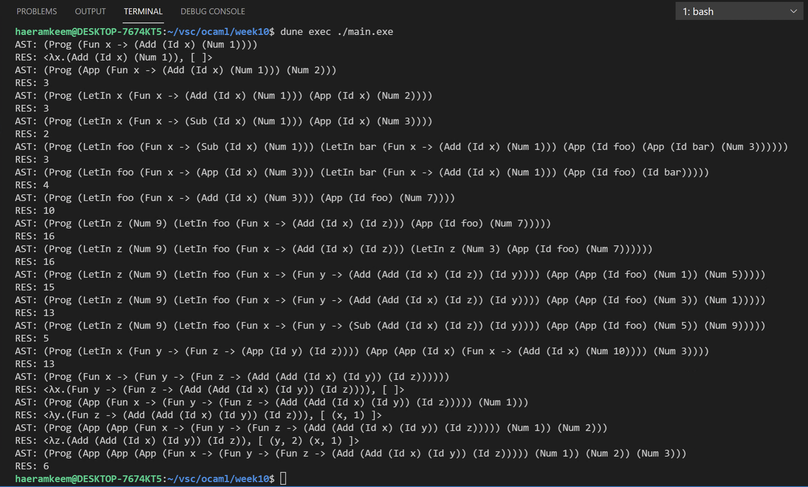

# 201702004 김해람 프로그래밍 언어 개론 10주차 과제
#21년1학기/프로그래밍언어개론/보고서

## 과제 설명
* First-order가 아닌 First-class function을 지원하는 VAE인 FVAE를 구성해본다.
- - - -
## 해결방법
### interp_e 함수
* 매개변수로 받은 _e_ 에 대해 pattern matching을 시도한다.
* **Num** : 정수를 _i_ 로 받되 pattern matching의 타입을 일치시켜주기 위해 Store.NumV로 형변환을 해준다.
* **Add**, **Sub** : 더하거나 뺄 두개의 expression을 _e1_, _e2_ 로 받되 interp_e에 _e1_, _e2_ 를 각각 넣어 재귀호출하여 결과를 계산한다. 이때 재귀호출한 결과는 Store.value이므로 각각의 결과값을 pattern matching하여 유효하지 않은 연산은 걸러낸다. 즉, 두 결과값중 하나라도 Store.ClosureV로 타입이 나온다면 함수의 덧셈은 정의되지 않았으므로 유효하지 않은 연산이라는 오류를 출력한다. 만약 두 결과값이 모두 Store.NumV라면 정수값을 _n1_ 과 _n2_ 로 받아 더하거나 뺀 후 pattern matching의 타입을 일치시켜주기 위해 Store.NumV로 형변환을 해준다.
* **Id** : 변수의 이름을 _v_ 로 받아 Store.find함수에 변수이름인 _v_ 와 현재의 store인 _s_ 를 넣어 호출하여 그의 결과를 반환한다.
* **LetIn** : 변수의 이름을 _v_ 로 받고 변수에 저장할 값에 대한 표현 _e1_ 를 interp_e와 현재의 store인 _s_ 를 이용해 계산해 낸다. 이후 Store.insert함수에 _v_, 계산해낸 결과, 현재의 store인 _s_ 를 넣어 호출해 업데이트된 store를 받고, 그것을 interp_e에 다시 넣어 다음에 계산해야 할 표현인 _e2_ 를 계산해낸다.
* **App** : 우선 첫번째 표현식 _e1_ 를 interp_e를 이용해 계산하여 그의 결과에 대해 pattern matching을 시도한다. 결과값이 Store.NumV의 형태라면 유효하지 않은 함수 이므로 오류를 출력한다. 하지만 결과값이 Store.ClosureV의 형태라면 유효한 함수이므로 apply할 준비를 한다. 결과값을 매개변수 이름은 _arg_ 로, 몸체는 _exp_, 선언당시의 store는 _st_ 로 받아온 후 먼저 interr_e함수를 재귀호출해 매개변수에 매핑해줄 값인 _e2_ 를 계산한다. 그 결과를 매개변수에 매핑해줘야 하므로 Store.insert 함수를 이용해 _st_ 를 업데이트해주고, 그 결과를 이용해 interp_e를 재귀호출하여 몸체인 _exp_ 를 연산해준다.
* **Fun** : 무명함수 정의시 필요한 매개변수 이름을 _arg_ 로, 함수의 몸체를 _exp_ 로 받아오고 현재의 store인 _s_ 까지 튜플로 묶어 반환한다. 단, 이것은 함수 값이므로 Store.ClosureV로 형변환을 해준다.
### interp 함수
* 매개변수로 받은 _p_ 은 Ast.fvae의 형태이므로 이것을 Ast.expr로 바꿔주기 위해 pattern matching해준다. 바뀐 것을 _exp_ 로 받아 interp_e를 호출하여 계산해준다. 다만 지금은 store가 비어있으므로 Store.empty를 store로 넣어준다.
- - - -
## 실행 결과
