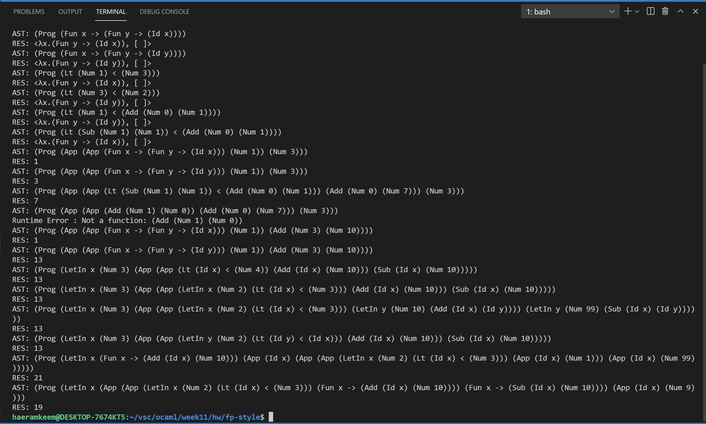

# 201702004 김해람 프로그래밍 언어 개론 11주차 과제
#21년1학기/프로그래밍언어개론/보고서

## 과제설명
* 분기문을 지원하는 CFVAE를 구성해본다
- - - -
## 해결방법
* 과제로 주어진 CFVAE는 true와 false를 함수로 표현하여 값의 도메인을 늘리지 않고 분기문도 Syntactic sugar를 이용하여 함수의 적용으로 처리하되 대소비교만 Abstract Syntax를 확장한 언어이다.
* 따라서 ast.ml의 expr 타입에 Lt만 추가되었으며 따라서 interpreter.ml의 interp_e함수에서 저 Lt를 지원할 수 있도록 수정해주었다
* expr타입의 Lt는 expr 두개의 튜플로 구성되는 자료형이다
* 따라서 interp_e함수에서는 Lt를 구성하는 튜플을 (_e1_, _e2_)로 받아오고 먼저 _e1_ 을 interp_e 함수를 재귀호출하여 연산한다.
* 그리고 이것의 결과가 NumV가 되어야 하므로 matching을 시도해 NumV일 경우에만 다음연산으로 넘어가고 아닌 경우에는 Invalid Less-Than 오류를 출력한다
* 두번째로는 _e2_ 를 interp_e 함수로 계산한 후 마찬가지로 NumV인 경우에만 다음연산으로 넘어가고 아닌 경우에는 Invalid Less-Than 오류를 출력한다.
* 이 둘의 연산결과가 NumV일 경우일때 이것들을 _n1_, _n2_ 로 받아오고 n1 < n2 를 if문에 넣어 참일때는 두 매개변수로 인자를 받아 첫번째 인자값을 반환하는 함수를 반환하고 거짓일때는 두번째 인자값을 반환하는 함수를 반환한다. 
* 우선 함수를 반환해야 하므로 Store.ClosureV 자료형을 사용힌디. 하지만 이번에는 인자를 두개 받는 함수를 반환해야 하므로 함수의 몸체로 함수를 입력해 함수를 반환하게 한다.
* 함수의 몸체는 expr자료형이므로 expr자료형의 함수표현식인 Fun을 이용한다. 그리고 이 함수의 몸체는 매개변수 둘 중 하나를 반환해야하므로 참과 거짓에 따라 첫번째 혹은 두번째 매개변수의 이름을 Id자료형을 이용해 반환한다.
- - - -
## 실행결과
