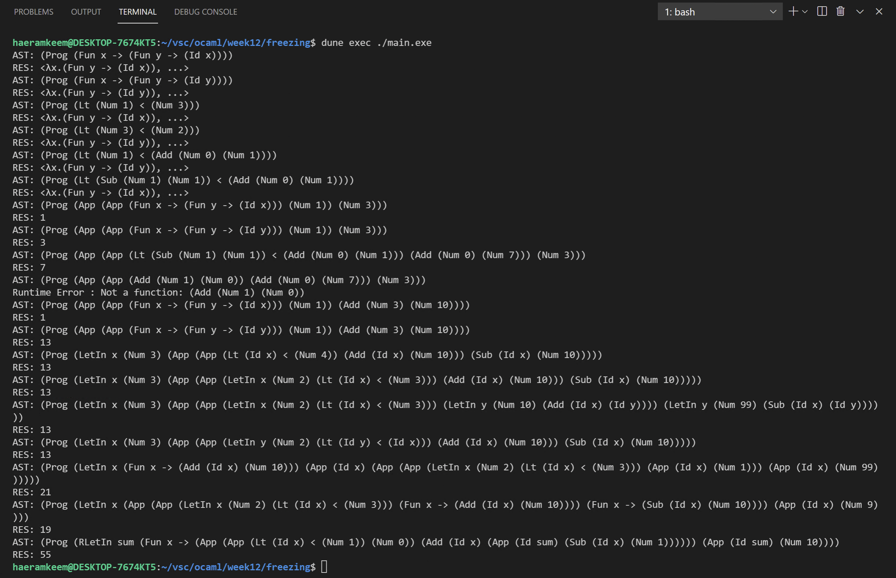

# 201702004 김해람 프로그래밍 언어 개론 12주차 과제
#21년1학기/프로그래밍언어개론/보고서

## 과제 설명
* 재귀 함수를 지원하는 언어인 RCFVAE를 구성해본다.
- - - -
## 해결방법
### Pattern Matching : Id

* 변수의 이름을 _v_ 로 받아와 Store.find 함수를 이용해 값을 얻어온다.
* 그리고 이 값이 Store.FreezedV 일 경우 interp_e함수를 재귀호출해 얼려진 값을 녹여 계산 결과값을 가져온다.
* 하지만 이 값이 Store.FreezedV가 아닐 경우 매치된 값을 그대로 반환한다
### Pattern Matching : RLetIn

* 함수의 몸체를 계산할때 자기자신 함수를 재귀적으로 호출해도 store에서 자기자신 함수를 찾을 수 있도록 store를 재귀적으로 구성하여 다음에 나오는 표현식인 _e2_ 를 계산해준다.
### Pattern Matching : App

* _e1_ 이 ClosureV일 경우에는 매개변수 _arg_ 와 _e2_ 를 매핑해서 함수 몸체를 계산할때 사용할 store인 _st_ 에 넣어주되 표현식을 얼리기 위해 Store.FreezedV 를 이용한다.
* 그리고 업데이트된 store를 이용해 함수의 몸체인 exp를 계산해준다
- - - -
## 실행결과
