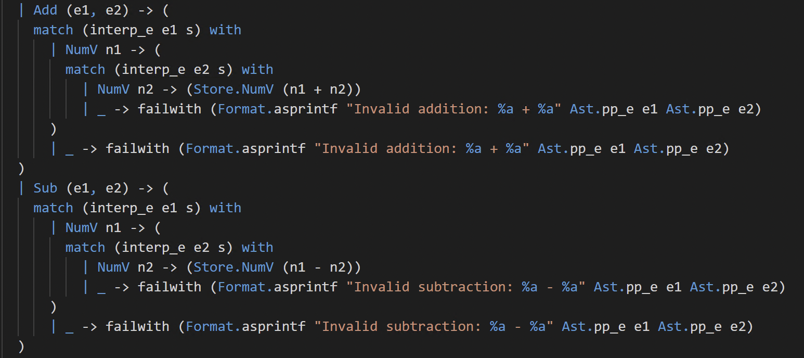
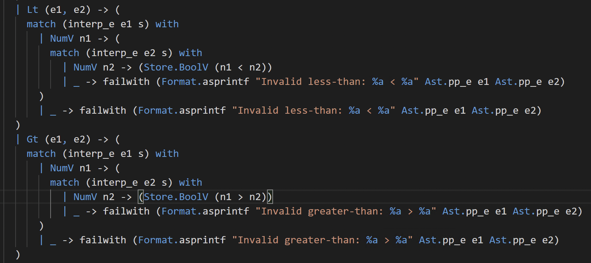
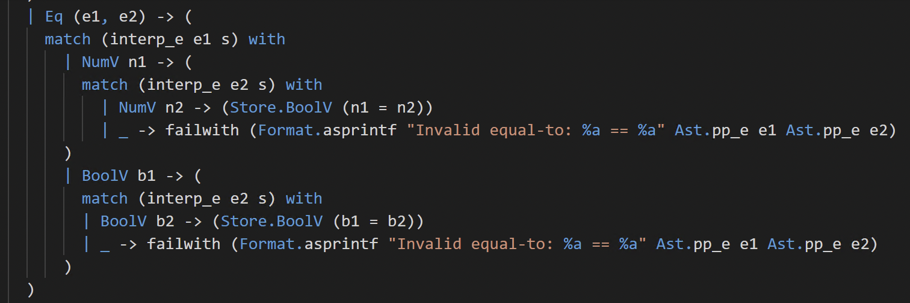
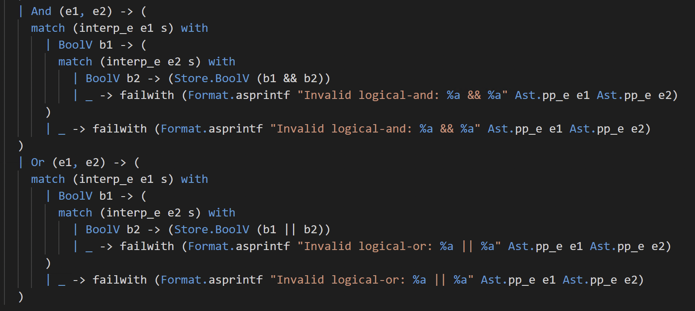
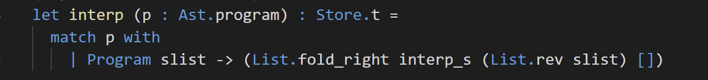
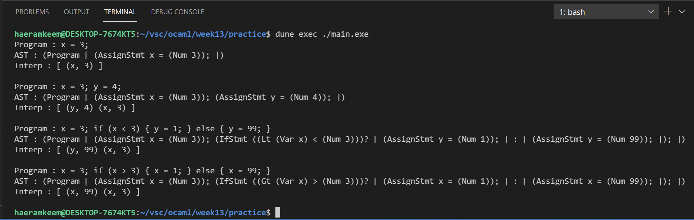

# 201702004 김해람 프로그래밍 언어 개론 13주차 과제
#21년1학기/프로그래밍언어개론/보고서
## 과제 설명
* 명령형 언어인 MiniC를 구현해본다.
- - - -
## 해결 방법
### interp_e 함수

	* e가 Num 타입이면 Store.NumV타입의 정수로 반환한다.
	* e가 Var 타입이면 Store.find함수를 호출해 Store에 저장된 해당 변수의 값을 가져온다.
	* e가 Bool타입이면 Store.BoolV타입의 boolean값으로 반환한다.

	* e가 Add타입이면 먼저 더할 두 expression을 e1, e2로 받아온 다음 e1부터 연산하여 결과값이 NumV타입이라면 e2를 연산하고 그렇지 않다면 오류를 출력한다.
	* e2의 연산결과가 NumV타입이면 e1의 연산결과인 n1과 e2의 연산결과인 n2를 더해 Store.NumV 타입으로 반환한다.
	* e2의 연산결과가 NumV타입이 아니라면 오류를 출력한다.
	* e가 Sub타입인 경우에도 마찬가지의 순서로 진행하되 n1 - n2를 Store.NumV 타입으로 반환한다.

	* e가 Lt타입이면 비교할 두 expression을 e1, e2로 받아오고 e1부터 연산하여 결과값이 NumV타입이면 e2를 연산하고 그렇지 않다면 오류를 출력한다.
	* e2의 결과값이 NumV타입이면 e1의 연산결과인 n1과 e2의 연산결과인 n2를 < 연산자를 통해 비교하여 Store.BoolV로 반환한다.
	* e2의 결과값이 NumV타입이 아니라면 오류를 반환한다.
	* e가 Gt타입인 경우에도 마찬가지의 순서로 진행하되 n1 > n2의 연산결과를 Store.BoolV타입으로 반환한다.

	* e가 Eq타입이면 비교할 두 expression을 e1, e2로 받아오고 e1부터 연산하여 결과값이 NumV인 경우와 BoolV인 경우를 구분한다.
	* 먼저 NumV일 경우에는 e2의 연산 결과값이 NumV인 경우에만 e1의 연산결과인 n1과 e2의 연산결과인 n2를 n1 = n2로 계산하여 Store.BoolV타입으로 반환한다. e2의 결과가 NumV가 아닌 경우에는 오류를 출력한다.
	* e1의 결과가 BoolV인 경우에는 e2의 연산 결과값이 BoolV인 경우에만 e1의 연산결과인 b1와 e2의 연산결과인 b2를 b1 = b2로 계산하여 Store.BoolV타입으로 반환한다. e2의 결과가 BoolV가 아닌 경우에는 오류를 출력한다.

	* e가 And타입이면 비교할 두 expression을 e1, e2로 받아오고 e1부터 연산하여 결과값이 BoolV타입인 경우에만 e2를 연산하고 그렇지 않은 경우에는 오류를 반환한다.
	* e2를 연산한 결과가 BoolV타입인 경우에는 e1의 연산결과인 b1과 e2의 연산결과인 b2를 &&연산자로 계산하여 Store.BoolV 타입으로 반환한다. 만약 e2를 연산한 결과가 BoolV타입이 아닌 경우에는 오류를 출력한다.
	* e가 Or타입일때도 마찬가지의 연산과정을 수행하되 b1과 b2를 ||연산자로 계산해 Store.BoolV타입으로 반환한다.
### interp_s

	* 먼저 stmt가 AssignStmt타입인 경우에는 변수의 이름을 str에, 변수에 저장될 값을 exp에 할당한다. 그리고 interp_e함수를 호출해 exp를 연산해주고 그의 결과를 str과 함께 Store.insert 함수를 호출해 기존의 메모리인 s를 업데이트시켜 반환한다.
	* stmt가 IfStmt타입인 경우에는 먼저 조건식을 exp로, true branch statement list를 stmt_list로, false branch statement list를 stmt_list_option로 받아온다. 
	* 조건식 exp를 interp_e로 연산하여 그의 결과가 BoolV 타입인 경우에는 분기하고 그렇지 않을 경우에는 오류를 출력한다.
	* 만약 BoolV 타입인 경우에는 그 타입의 값을 bln으로 받아오고 이 값에 대해 if then else문을 적용하여 true branch로 분기해야할지 false branch로 분기해야 할지 결정한다.
	* true branch인 경우에는 stmt_list의 statement의 원소들을 하나씩 연산해줘야 하는데 한 statement의 연산 결과가 다음 연산에 쓰이므로 List의 fold함수를 이용한다.
	* 먼저 interp_s함수를 fold함수의 인자로 넣어줘야 하는데 이 함수는 ‘a -> ‘b -> ‘b의 타입이므로 이 타입의 함수를 적용시킬 수 있는 fold함수인 List.fold_right를 이용한다.
	* 그리고 fold_right함수의 경우 리스트의 마지막 원소부터 연산하므로 stmt_list를 List.rev함수를 이용해 순서를 뒤집어 인자로 넣어준다. 그리고 init으로 초기의 store인 s를 넣어주면 함수가 정상적으로 구동된다.
	* false branch인 경우에는 먼저 stmt_list_option이 option타입이므로 None인지 Some인지 matching해준다.
	* None인 경우에는 기존의 store인 s를 그대로 반환하고 Some인 경우에는 list를 slist로 받아와 List.fold_right함수를 이용해 업데이트된 store를 반환한다.
### interp_p

	* p의 타입인 Ast.program도 Program타입의 statement list이므로 pattern matching을 통해 해당 statement list를 slist로 받아온다.
	* 그리고 이것도 마찬가지로 statement하나가 실행될때마다 store가 바뀌므로 statement하나를 처리한 결과를 다음 statement의 처리에 이용하므로 List.fold_right함수를 이용해 처리한다.
- - - -
## 실행결과
