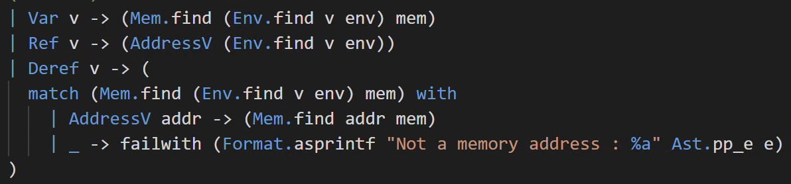
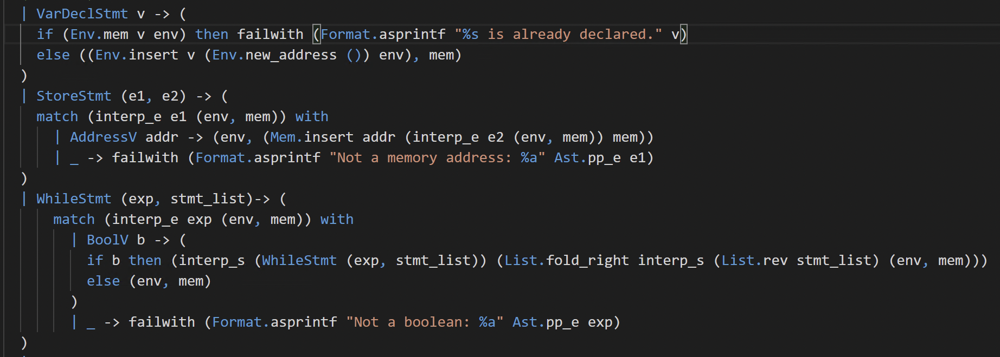
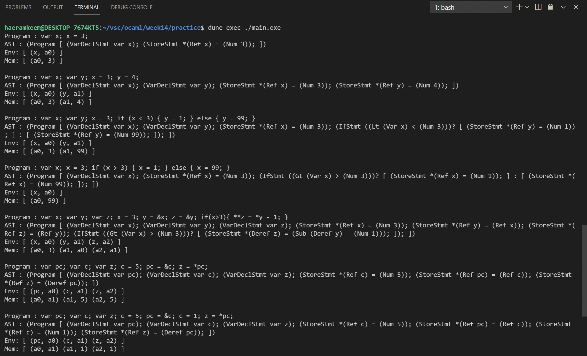
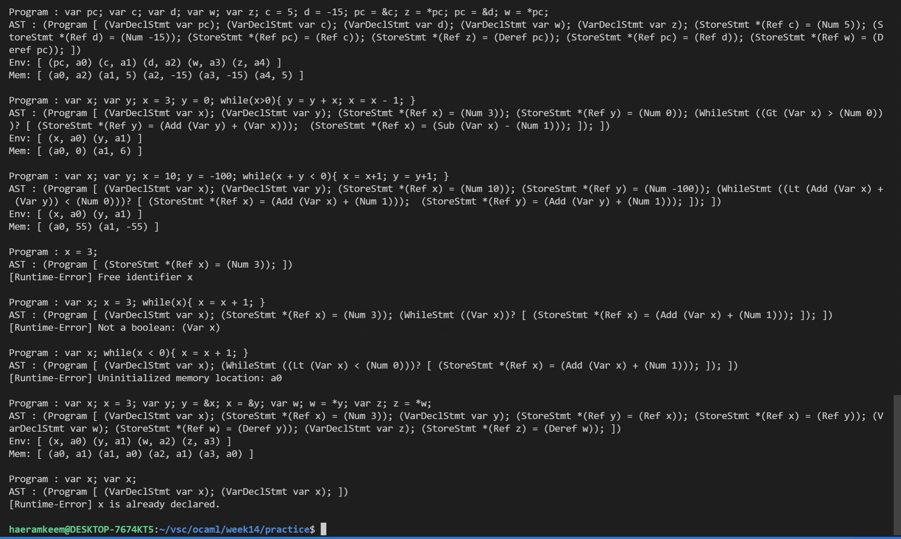

# 201702004 김해람 프로그래밍 언어 개론 14주차 과제
#21년1학기/프로그래밍언어개론

## 과제 설명
* 명령형 언어인 MiniC에 반복문과 포인터 개념을 추가해본다.
- - - -
## 해결방법
* 저번주차의 실습에서는 store s를 사용했지만 이번 실습에서는 _env_, _mem_ 를 사용하기 때문에 s를 사용하는 모든 부분을 _(env, mem)_ 의 튜플로 변환한다.
### interp_e 함수 변경사항

* **Var**타입의 expression이 입력되었을 때 : 이 경우에는 변수의 이름 _v_ 로 저장된 값을 찾는 경우이므로 Env.find함수를 통해 변수이름 _v_ 와 변수가 할당받은 주소값을 저장하는 메모리인 _env_ 로 변수에 대한 주소값을 얻어낸다. 그리고 그 값과 주소에 저장된 값을 저장하는 메모리인 _mem_ 을 함수 Mem.find에 넣어 최종적으로 값을 얻어낸다.
* **Ref**타입의 expression이 입력되었을 때 : 이 경우에는 변수의 이름으로 변수가 할당받은 주소를 찾는 경우이므로 먼저 함수 Env.find를 변수이름 _v_ 와 메모리인 _mem_ 을 인자로 호출하여 정수형태의 주소값을 알아낸다. 이후 AddressV 타입 생성자를 통해 해당 타입의 값으로 변경한다.
* **Deref**타입의 expression이 입력되었을 때 : 이 경우에는 변수의 이름 _v_ 와 메모리 _env_ 를 통해 해당 변수가 할당받은 주소값을 알아내어 정수형태로 _addr_ 에 저장한다. 만일 변수 _v_ 에 담겨있던 값이 주소가 아닐 경우에는 오류를 출력한다. _addr_ 를 다시 한번 메모리 mem에서 Mem.find함수를 통해 해당 주소에 담긴 값을 반환하는것으로 동작을 종료한다.
### interp_s 변경사항

* **VarDeclStmt**타입의 statement가 입력되었을 때 : 해당 statement는 변수에 주소를 할당하는 것이므로 일단 변수의 이름 _v_ 를 메모리 _env_ 에서 Env.mem 함수를 통해 이미 주소를 할당받은 변수인지 확인한다. 이미 할당받은 경우에는 오류를 출력하고, 할당받지 않은 경우에는 주소를 할당해주는 작업을 추가한다. 일단 Env.new_address함수를 통해 새로운 주소공간을 할당받는다. 그리고 변수 _v_ 와 해당 주소값을 메모리 _env_ 에 Env.insert 함수를 통해 저장한다. 그리고 Env.insert함수의 경우에는 업데이트된 메모리를 반환하므로 이것과 변경되지 않은 _mem_ 을 튜플로 묶어 반환한다.
* **StoreStmt**타입의 statement가 입력되었을 때 : 해당 statement는 주소에 저장된 값을 바꿔주는 것이다. 이 statement는 expression 두개를 _(e1, e2)_ 의 튜플로 입력받는데 먼저 e1를 interp_e함수를 통해 계산해낸다. 이것의 결과가 AddressV이어야 해당 주소에 저장된 값을 변경할 수 있으므로 결과를 match했을 때 AddressV인 경우에만 정상적으로 작동하고 그렇지 않은 경우에는 오류를 출력하도록 한다. 정상적인 경우에는 우선 interp_e함수를 통해 e2의 값을 계산해낸다. 그리고 e1의 계산결과로 나온 주소값인 _addr_ 에 e2의 계산결과가 매핑될 수 있도록 Mem.insert함수를 호출한다. Mem.insert함수의 반환값이 업데이트된 mem이므로 이것과 변경되지 않은 env를 튜플로 묶어 반환한다.
* **WhileStmt**타입의 statement가 입력되었을 때 : 해당 statement는 반복문에 대한 것이다. 우선 조건식에 해당하는 _exp_ 를 interp_e를 통해 계산해준다. 그리고 이것의 결과가 BoolV 타입일 경우에만 정상적으로 작동하게 하고 아닌 경우에는 오류를 출력하게 한다. BoolV타입인 경우에는 그의 값을 _b_ 로 받아온 뒤 if-then-else문을 이용해 조건식이 참인지 거짓인지 판별한다. 만약 참일때는 우선 while문의 몸체에 해당하는 _stmt_list_ 를 List.fold_right함수에 _interp_s_ 함수와 같이 넣어 연산해낸다. 이것의 결과는 업데이트된 추상메모리인데 이것을 이용해 다시 조건식이 참인지 아닌지 판단하고, 참이라면 몸체를 다시 계산해주기 위해 재귀적으로 작동하도록 구성해준다. 우선 입력받은 조건식과 while문의 몸체를 _(exp, stmt_list)_ 튜플을 통해 묶고, WhileStmt 타입의 생성자를 통해 새로운 while문 statement를 생성한다. 그리고 이 statement를 연산할때 기존의 추상메모리인 _(env, mem)_ 를 사용하는 것이 아니고 업데이트된 추상메모리를 사용하기 위해 List.fold_right함수의 반환값을 interp_s 함수에 넣어줘 다시끔 while문이 돌아갈 수 있도록 한다. 그리고 조건식의 결과가 거짓이 되면 추상메모리를 업데이트하지 않고 그대로 반환하기 위해 _(env, mem)_ 튜플을 반환한다.
- - - -
## 실행결과

